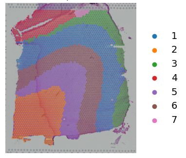
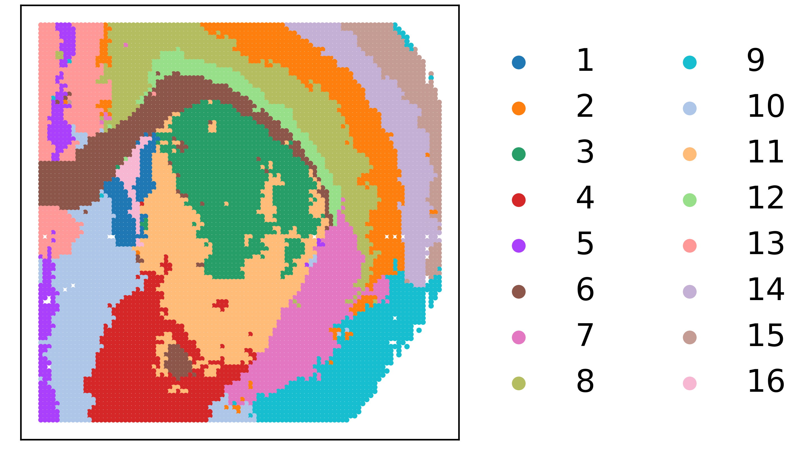
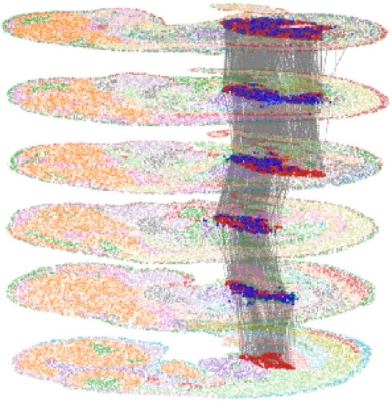

# 3d-OT
[](https://github.com/dbjzs/3d-OT/stargazers)
[](https://github.com/dbjzs/3d-OT/forks)


3d-OT can be used for single-modal and multimodal spatial domain recognition, single-modal, multi-modal, and cross-platform alignment tasks, as well as 3D reconstruction.


## Overview
3d-OT leverages the PointNet++ model and optimal transport with soft communication as its foundation. Through a modular integration approach, it seamlessly supports single-modal, multi-modal, and diverse spatial omics data from various technologies. By precisely extracting meaningful features from positional information, 3d-OT achieves high-resolution analysis of spatial omics data. Utilizing the framework of soft communication optimal transport, it effectively tackles challenges such as non-rigid alignment and inconsistent resolution during the alignment process. Furthermore, it introduces a novel evaluation metric, the Chamfer distance, to assess alignment quality.

## Requirements
You'll need to install the following packages in order to run the codes.
* Python==3.10.13
* anndata==0.10.5.post1
* matplotlib==3.6.2
* numpy==1.26.3
* pandas==2.2.3
* scanpy==1.9.8
* torch==2.2.0
* torch_geometric==2.4.0
* scikit-learn==1.4.0
* scipy==1.12.0
* scikit-misc==0.5.1
* tqdm==4.67.1
* R==4.3.1
* rpy2==3.5.11
* ploty
* nbformat
* libopenblas==0.3.25


## Tutorial
All the result tutorials mentioned in the text can be found [here](https://3d-ot.readthedocs.io/en/latest/)


  

## Installation
```
git clone https://github.com/dbjzs/3d-OT.git
cd 3d-OT
conda create -n 3d-OT -f environment.yaml
conda activate 3d-OT
pip install -r requirements.txt
pip install git+https://github.com/dbjzs/3d-OT.git
```
## Reference
- If you find 3d-OT useful for your research, please consider citing the 3d-OT manuscript.
```
@article{Dai 2026,
  author    = {Dai, et al.},
  title     = {3d-OT: A Deep Geometry-aware Framework for Heterogeneous Slices Alignment of Spatial Multi-omics},
  journal   = {Nature Methods},
  year      = {2026},
  url       = {Acceptance in principle}
}
```
